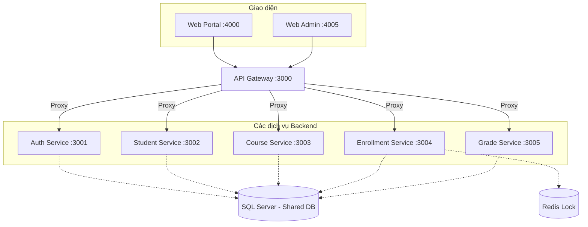
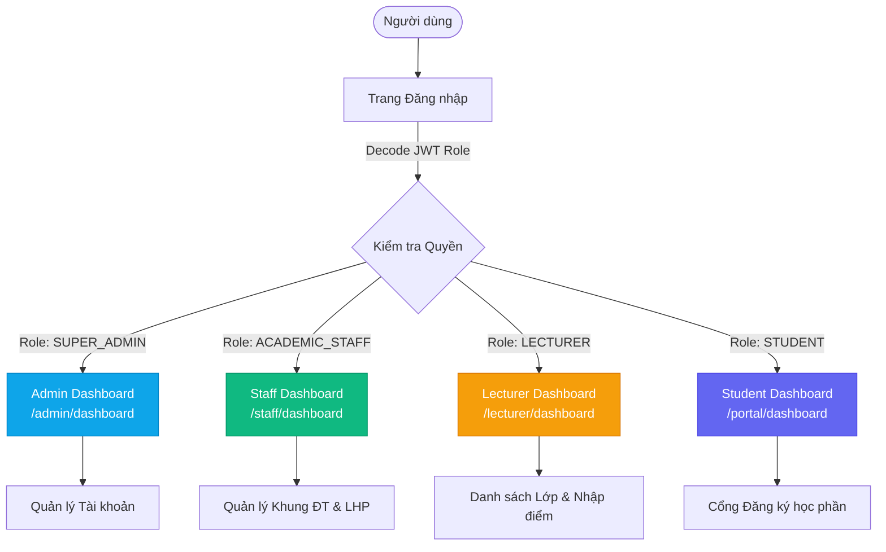

# 🎓 Hệ thống Quản lý Sinh viên (University Management System)

Hệ thống Quản lý sinh viên là một nền tảng quản trị giáo dục hiện đại được xây dựng trên kiến trúc **Microservices** và quản lý mã nguồn dưới mô hình **Monorepo** (bằng Turborepo). 

Dự án này tập trung giải quyết các bài toán nghiệp vụ phức tạp của trường đại học như: đăng ký học phần (với lượng truy cập đồng thời lớn), tính toán bảng điểm, quản lý tài chính và quản trị phân quyền đa cấp độ.

---

## 🚀 Các Tính Năng Nổi Bật

### 👨‍🎓 1. Cổng Sinh viên (Web Portal) - `:4000`
- **Dashboard**: Xem tiến độ học tập (GPA/CPA), số tín chỉ tích lũy, biểu đồ thống kê trực quan.
- **Đăng ký Học phần**: Xử lý tải cao, áp dụng thuật toán `Distributed Lock` (với Redis) để đảm bảo không bị vượt slot (Overbooking).
- **Xem Lịch & Điểm**: Lịch học hàng tuần và tra cứu bảng điểm, xếp loại học lực.
- **Tài chính**: Tra cứu công nợ (Học phí, Bảo hiểm...), các hóa đơn thanh toán.
- **Hồ sơ cá nhân**: Quản lý thông tin liên lạc, lịch sử gia đình, và thông tin hành chính.

### 🛡️ 2. Cổng Quản lý (Web Admin) - `:4005`
Dành cho cán bộ (Academic Staff), giảng viên (Lecturer), và người quản trị hệ thống (Super Admin).
- **Phân quyền chặt chẽ (RBAC)**: Middleware chặn các quyền truy cập chéo. Mỗi Role có một không gian làm việc và Dashboard riêng.
- **Quản lý Đào tạo**: Thiết lập cấu trúc Khoa - Ngành - Môn học - Chương trình khung.
- **Xếp lịch & Quản lý lớp**: Khởi tạo lớp học phần, phòng học.
- **Quản lý Học vụ**: Giảng viên vào điểm điểm danh, điểm giữa kỳ, thi cuối kỳ tự động quy đổi (hệ 10 sang hệ 4 và điểm chữ). Thống kê rèn luyện sinh viên.
- **Biểu đồ thời gian thực (Real-time charts)**: Báo cáo tỷ lệ sinh viên, doanh thu học phí tổng quan.

---

## 🏗️ Kiến Trúc Hệ Thống (Microservices)

Hệ thống được chia nhỏ thành các domain rõ ràng (Loose Coupling), đằng sau 1 API Gateway duy nhất:



* Swagger API được cấu hình tập trung tại Gateway: Truy cập `http://localhost:3000/api-docs` để xem tài liệu tương tác cho toàn bộ các service.

---

## 🛠️ Công Nghệ & Luồng Dữ Liệu

- **Backend Platform**: Node.js 18+ với NestJS (v10+).
- **Frontend Platform**: React với Next.js 14/16 (App Router) & Tailwind CSS v3/v4.
- **Database & ORM**: Microsoft SQL Server thông qua Type-safe ORM Prisma. Thiết kế `Shared Database` tại tầng `packages/database`.
- **Cơ chế Locking**: Redis (giữ Slot đăng ký chống trùng lặp dữ liệu).
- **Build System**: Turborepo để tối ưu hóa caching và chạy lệnh song song trên Monorepo.
- **API Proxy**: Middleware (http-proxy-middleware) tại cấu hình NestJS API Gateway.

---

## ⚙️ Hướng Dẫn Cài Đặt (Local Development)

### 1. Chuẩn bị môi trường
- **Node.js**: Phiên bản >= 18.x
- **Docker Desktop**: Chạy Redis container.
- **SQL Server**: Cài đặt trực tiếp hoặc chạy trên Docker.

### 2. Thiết lập dự án

1. **Cài đặt dependencies** (cài đặt cho toàn bộ các workspace nhờ monorepo):
   ```bash
   npm install
   ```

2. **Khởi động Redis Container** (Quan trọng cho nghiệp vụ đăng ký học phần):
   ```bash
   docker-compose up -d
   ```

3. **Cấu hình biến môi trường (.env)**:
   Tạo file `.env` ở thư mục gốc (nếu chưa có) dựa trên `.env.example`:
   ```env
   DATABASE_URL="sqlserver://localhost:1433;database=student_db;user=SA;password=YourPassword;trustServerCertificate=true"
   REDIS_URL="redis://localhost:6379"
   JWT_SECRET="sms_secret_key"
   ```

4. **Đồng bộ CSDL và tạo dữ liệu giả lập (Seed)**:
   ```bash
   npm run db:push
   npm run db:seed
   ```
   *(Ghi chú: Lệnh `npx prisma generate` cấu hình tự động chạy để sinh Prisma Client Types cho TypeScript)*

5. **Chạy toàn bộ hệ thống** (Lệnh này sẽ gọi Turborepo boot toàn bộ frontend/backend song song):
   ```bash
   npm run dev
   ```

### 3. Cổng (Ports) trong Hệ thống khi Dev:
- Cổng kết nối Sinh viên: `http://localhost:4000`
- Cổng kết nối Admin & GV: `http://localhost:4005`
- Cổng API Trung gian (Swagger Docs): `http://localhost:3000/api-docs`

---

## 📝 Cấu trúc Monorepo & Quy tắc Phát triển

Dự án này áp dụng phương thức chia sẻ thư viện (Shared Library Pattern):
- `packages/database`: Nơi quy tụ duy nhất của file `schema.prisma`. Khi thay đổi bảng, luôn vào đây chỉnh sửa và chạy `npx prisma db push`.
- `packages/shared-dto`: Nơi định nghĩa các Class DTO (ví dụ LoginDto), phục vụ việc định cấu hình Swagger UI cho Backend.
- `apps/*`: Tuyệt đối tránh việc service A gọi code DB hay Model của service B một cách lộn xộn, hãy giữ tính độc lập cao nhất và giao tiếp nhau qua Call HTTP proxy.

---

## 🔐 Phân quyền (RBAC) & Giao diện Dashboard

Hệ thống cung cấp 4 vai trò chính với các chức năng và Dashboard độc lập:

| Vai trò (Role) | Mã định danh | Cổng truy cập | Chức năng nổi bật |
|---|---|---|---|
| **SUPER_ADMIN** | `9xxxxxxxxx` | Web Admin (`:4005/admin/*`) | Toàn quyền hệ thống, quản lý tài khoản, xem thống kê doanh thu - số liệu tổng thể trường. |
| **ACADEMIC_STAFF**| `8xxxxxxxxx` | Web Admin (`:4005/staff/*`) | Quản lý Khoa/Ngành, Lớp học phần, cấu hình khung đào tạo và xếp Thời khóa biểu. |
| **LECTURER** | `3xxxxxxxxx` | Web Admin (`:4005/lecturer/*`)| Xem lịch dạy, danh sách lớp phụ trách, nghiệp vụ vào điểm và điểm danh sinh viên. |
| **STUDENT** | `Mã SV` | Web Portal (`:4000/portal/*`)| Đăng ký học phần, theo dõi GPA/CPA, xem lịch học, bảng điểm và thanh toán học phí. |

### Sơ đồ Điều hướng Phân quyền (Navigation Flow)



### Hình ảnh Giao diện (Screenshots)

Dưới đây là không gian làm việc của các phân quyền:

**1. Màn hình SUPER_ADMIN**


**2. Màn hình ACADEMIC_STAFF (Phòng Đào Tạo)**


**3. Màn hình LECTURER (Giảng viên)**


**4. Màn hình STUDENT (Sinh viên)**

