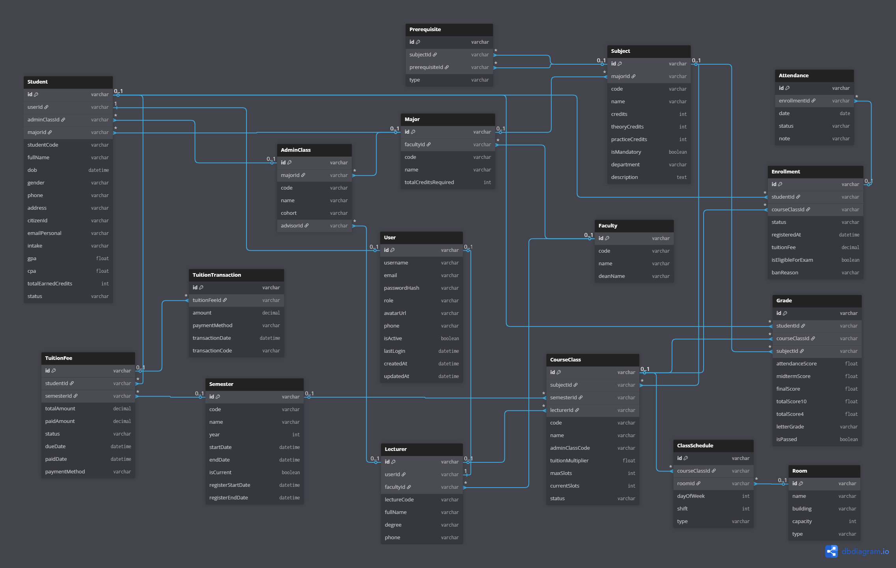
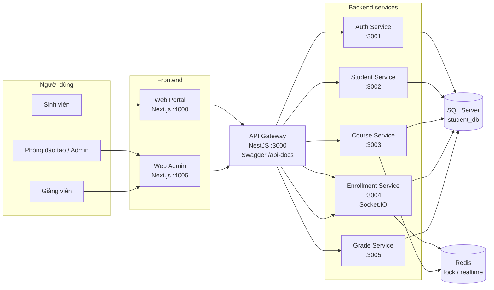

# Hệ thống Quản lý Sinh viên UNETI theo kiến trúc Microservices

Đây là dự án khóa luận xây dựng hệ thống quản lý sinh viên cho môi trường đại học, định hướng theo các nghiệp vụ đào tạo thực tế: quản lý tài khoản, phân quyền, hồ sơ sinh viên, chương trình đào tạo, lớp học phần, đăng ký học phần, thời khóa biểu, điểm danh, nhập điểm, học phí, điểm rèn luyện, thông báo và báo cáo điều hành.

Dự án được tổ chức theo mô hình **monorepo** với **Turborepo**, backend theo kiến trúc **microservices** bằng **NestJS**, frontend bằng **Next.js**, cơ sở dữ liệu **Microsoft SQL Server** qua **Prisma ORM**, và **Redis** cho các bài toán lock/đồng bộ realtime.



## Điểm nổi bật

- Tách hệ thống thành 5 backend service độc lập, được gom sau một API Gateway duy nhất.
- Có hai giao diện riêng: Web Portal cho sinh viên và Web Admin cho quản trị viên, phòng đào tạo, giảng viên.
- Xác thực bằng JWT, phân quyền theo vai trò và điều hướng giao diện theo role.
- Đăng ký học phần có Redis/Redlock để hạn chế vượt sĩ số khi có nhiều request đồng thời.
- Điểm danh QR/OTP qua Socket.IO, có hỗ trợ xác minh vị trí GPS theo bán kính cho phép.
- Quản lý điểm theo quy trình: nhập điểm, gửi duyệt, phê duyệt, khóa/mở khóa điểm.
- Tự động tính điểm chuyên cần từ dữ liệu điểm danh, tính điểm hệ 10, hệ 4, điểm chữ, GPA và CPA.
- Quản lý học phí theo học kỳ, khoản thu cố định, giao dịch thanh toán và điều kiện dự thi.
- Có Docker Compose để chạy SQL Server, Redis, API Gateway, các service backend và hai frontend.

## Kiến trúc tổng thể


```mermaid
flowchart LR
    subgraph Client["Người dùng"]
        Student["Sinh viên"]
        Staff["Phòng đào tạo / Admin"]
        Lecturer["Giảng viên"]
    end

    subgraph Frontend["Frontend"]
        Portal["Web Portal\nNext.js :4000"]
        Admin["Web Admin\nNext.js :4005"]
    end

    Gateway["API Gateway\nNestJS :3000\nSwagger /api-docs"]

    subgraph Services["Backend services"]
        Auth["Auth Service\n:3001"]
        StudentSvc["Student Service\n:3002"]
        Course["Course Service\n:3003"]
        Enrollment["Enrollment Service\n:3004\nSocket.IO"]
        Grade["Grade Service\n:3005"]
    end

    MSSQL[("SQL Server\nstudent_db")]
    Redis[("Redis\nlock / realtime")]

    Student --> Portal
    Staff --> Admin
    Lecturer --> Admin
    Portal --> Gateway
    Admin --> Gateway
    Gateway --> Auth
    Gateway --> StudentSvc
    Gateway --> Course
    Gateway --> Enrollment
    Gateway --> Grade
    Gateway --> Enrollment
    Auth --> MSSQL
    StudentSvc --> MSSQL
    Course --> MSSQL
    Enrollment --> MSSQL
    Grade --> MSSQL
    Enrollment --> Redis
    Course --> Redis
```

API Gateway nhận request từ frontend tại tiền tố `/api/*`, kiểm tra JWT/RBAC cơ bản và proxy về service đúng domain.

| Nhóm API | Service xử lý | Route qua Gateway |
| --- | --- | --- |
| Xác thực, tài khoản, thông báo | `auth-service` | `/api/auth/*`, `/api/notifications/*` |
| Sinh viên, học phí, điểm rèn luyện | `student-service` | `/api/students/*`, `/api/student-fees/*`, `/api/training-results/*` |
| Khoa/ngành/môn/lớp/lịch/kế hoạch đào tạo | `course-service` | `/api/courses/*`, `/api/subjects/*`, `/api/semester-plan/*` |
| Đăng ký học phần, điểm danh | `enrollment-service` | `/api/enrollments/*`, `/socket.io/*` |
| Điểm, GPA/CPA, học vụ | `grade-service` | `/api/grades/*` |

Swagger UI tập trung: `http://localhost:3000/api-docs`.

## Công nghệ sử dụng

| Lớp | Công nghệ |
| --- | --- |
| Monorepo | npm workspaces, Turborepo |
| Backend | Node.js, NestJS, TypeScript |
| Frontend | Next.js 14 App Router, React 18, Tailwind CSS |
| Database | Microsoft SQL Server 2022, Prisma ORM |
| Lock / realtime | Redis, Redlock, Socket.IO |
| Auth | JWT, Passport strategy, role-based access control |
| UI / chart | lucide-react, Recharts, Framer Motion, Radix UI |
| DevOps | Docker, Docker Compose, multi-stage Dockerfile |

## Cấu trúc thư mục

```text
.
|-- apps/
|   |-- api-gateway/          # Gateway NestJS, proxy API và Swagger tổng hợp
|   |-- auth-service/         # Đăng nhập, tài khoản, mật khẩu, thông báo
|   |-- student-service/      # Hồ sơ sinh viên, dashboard, học phí, điểm rèn luyện
|   |-- course-service/       # Khoa, ngành, môn, lớp, phòng, lịch, kế hoạch đào tạo
|   |-- enrollment-service/   # Đăng ký học phần, hủy/chuyển lớp, điểm danh QR
|   |-- grade-service/        # Quản lý điểm, GPA/CPA, học vụ
|   |-- web-admin/            # Giao diện admin/phòng đào tạo/giảng viên
|   `-- web-portal/           # Cổng thông tin sinh viên
|-- packages/
|   |-- database/             # Prisma schema, Prisma client exports, database utilities
|   |-- shared-dto/           # DTO dùng chung cho Swagger/API contract
|   |-- shared-utils/         # Guard, strategy, tính điểm và tiện ích dùng chung
|   |-- eslint-config/        # Cấu hình ESLint nội bộ
|   `-- typescript-config/    # Cấu hình TypeScript nội bộ
|-- docker/mssql/init-db.sh   # Tạo database ban đầu trong container SQL Server
|-- scripts/                  # Script audit/seed dữ liệu hỗ trợ
|-- docker-compose.yml
|-- Dockerfile
|-- turbo.json
`-- package.json
```

## Chức năng theo ứng dụng

### Web Portal cho sinh viên (`http://localhost:4000`)

Mã nguồn: `apps/web-portal`.

- Đăng nhập, đăng ký, quên mật khẩu, đổi mật khẩu.
- Dashboard học tập: GPA, CPA, tín chỉ tích lũy, tiến độ chương trình đào tạo.
- Xem hồ sơ cá nhân, thông tin hành chính, liên hệ và thông tin gia đình.
- Xem chương trình đào tạo, học phần, chi tiết học phần.
- Đăng ký học phần, xem lớp còn slot, lớp đã đăng ký và trạng thái đăng ký.
- Xem thời khóa biểu theo học kỳ.
- Xem lịch sử điểm danh và quét QR/OTP để điểm danh.
- Xem bảng điểm, kết quả học tập, điểm chữ, điểm hệ 10/hệ 4.
- Xem học phí, công nợ, khoản thu và giao dịch.

### Web Admin cho quản trị, phòng đào tạo, giảng viên (`http://localhost:4005`)

Mã nguồn: `apps/web-admin`.

**SUPER_ADMIN**

- Dashboard tổng quan hệ thống.
- Quản lý tài khoản người dùng.
- Quản lý nhân viên, giảng viên, sinh viên.
- Cấp tài khoản cho giảng viên/sinh viên.

**ACADEMIC_STAFF / phòng đào tạo**

- Quản lý khoa, bộ môn, ngành, lớp hành chính, khóa tuyển sinh.
- Quản lý môn học, chương trình đào tạo, khung học kỳ.
- Quản lý phòng học, giảng viên, lớp học phần.
- Tạo lớp học phần thủ công, tạo hàng loạt, import và đẩy danh sách sinh viên vào lớp.
- Lập lịch học, sửa buổi học, phát sinh lịch học, kiểm tra và xử lý trùng lịch.
- Lập kế hoạch học kỳ, sao chép chương trình đào tạo, chạy quy trình EMS/auto schedule.
- Lập lịch thi, chia phòng thi, xem nhóm thi.
- Quản lý điểm, phê duyệt/khoá điểm, nhắc giảng viên nộp điểm.
- Quản lý học phí, khoản thu cố định, gán phí hàng loạt, xác nhận thanh toán, điều kiện dự thi.
- Quản lý điểm rèn luyện và đánh giá học vụ.
- Gửi thông báo đến người dùng.

**LECTURER / giảng viên**

- Dashboard giảng viên.
- Xem lịch dạy, lớp phụ trách, chi tiết lớp.
- Điểm danh sinh viên thủ công hoặc qua QR/OTP.
- Nhập điểm thành phần, điểm thi, ghi chú điểm.
- Theo dõi thông báo, hồ sơ và cấu hình cá nhân.

## Chức năng theo backend service

### API Gateway (`apps/api-gateway`, port `3000`)

- Cấu hình CORS theo `CORS_ORIGIN`.
- Kiểm tra JWT và role từ token/header.
- Proxy request đến từng microservice.
- Proxy Socket.IO cho điểm danh realtime.
- Tổng hợp Swagger UI tại `/api-docs`.

### Auth Service (`apps/auth-service`, port `3001`)

- Đăng nhập, đăng ký.
- Đổi mật khẩu, quên mật khẩu, đặt lại mật khẩu qua email SMTP.
- CRUD tài khoản người dùng.
- Quản lý giảng viên và cấp tài khoản giảng viên.
- Tạo tài khoản sinh viên.
- Quản lý thông báo cá nhân và broadcast thông báo.

### Student Service (`apps/student-service`, port `3002`)

- CRUD sinh viên.
- Import/export dữ liệu sinh viên.
- Tra cứu sinh viên theo lớp hành chính, user id, mã sinh viên.
- Thống kê dashboard theo khoa, ngành, khóa tuyển sinh, học kỳ.
- Quản lý học phí: danh sách công nợ, cập nhật phí, xác nhận thanh toán, điều kiện dự thi.
- Quản lý cấu hình khoản thu cố định và gán phí hàng loạt.
- API `student-fees` cho sinh viên xem học phí và giao dịch.
- Quản lý điểm rèn luyện theo sinh viên/lớp.

### Course Service (`apps/course-service`, port `3003`)

- Quản lý khoa, bộ môn, ngành, chuyên ngành.
- Quản lý khóa tuyển sinh và học kỳ theo khóa.
- Quản lý lớp hành chính, giảng viên, phòng học.
- Quản lý môn học, số tín chỉ, tiết lý thuyết/thực hành, hình thức thi.
- Quản lý chương trình đào tạo và sao chép khung chương trình.
- Quản lý lớp học phần, sĩ số, trạng thái, giảng viên và lớp hành chính liên quan.
- Tạo lịch học, tạo buổi học thủ công, đổi lịch, xóa buổi học.
- Phát hiện và xử lý trùng lịch phòng/giảng viên/lớp.
- Lập kế hoạch học kỳ, tạo lớp từ kế hoạch, rebuild schedule, global automate.
- Lập lịch thi, xem phòng thi, lịch thi cá nhân/giảng viên.

### Enrollment Service (`apps/enrollment-service`, port `3004`)

- Đăng ký học phần.
- Hủy đăng ký, xóa đăng ký, chuyển lớp học phần.
- Xem tổng quan đăng ký của sinh viên.
- Lấy danh sách lớp có thể đăng ký theo học kỳ/môn học.
- Kiểm tra trạng thái đăng ký và danh sách lớp đã đăng ký.
- API quản lý danh sách sinh viên trong lớp.
- Điểm danh hàng loạt.
- Socket.IO gateway cho QR/OTP điểm danh:
  - Giảng viên tạo OTP theo buổi học.
  - Sinh viên quét OTP.
  - Kiểm tra thời hạn OTP và phạm vi GPS nếu giảng viên cung cấp tọa độ.
  - Đồng bộ kết quả điểm danh về điểm chuyên cần.

### Grade Service (`apps/grade-service`, port `3005`)

- Khởi tạo bảng điểm cho lớp học phần.
- Lấy bảng điểm theo sinh viên/lớp.
- Cập nhật điểm hàng loạt.
- Nộp điểm, phê duyệt điểm, khóa/mở khóa điểm.
- Đồng bộ điểm chuyên cần từ dữ liệu điểm danh.
- Tính điểm tổng kết, điểm chữ, hệ 4 và trạng thái qua môn.
- Tính GPA học kỳ, CPA tích lũy, tóm tắt học vụ.
- Tạo dữ liệu demo học vụ, điểm rèn luyện, lớp học lại khi cần.
- Báo cáo tiến độ học vụ theo lớp hành chính.

## Mô hình dữ liệu chính

Prisma schema nằm tại `packages/database/prisma/schema.prisma`. Các nhóm bảng quan trọng:

- Tài khoản và thông báo: `User`, `Notification`.
- Đào tạo: `Faculty`, `Department`, `Major`, `Specialization`, `AcademicCohort`, `CohortSemester`.
- Sinh viên và lớp: `Student`, `FamilyMember`, `AdminClass`, `Lecturer`.
- Chương trình đào tạo: `Subject`, `Prerequisite`, `Curriculum`, `TrainingPlanTemplate`, `SemesterPlan`.
- Lớp học phần và lịch: `CourseClass`, `ClassSession`, `Room`, `Semester`.
- Đăng ký và điểm danh: `Enrollment`, `Attendance`.
- Điểm và học vụ: `Grade`, `TrainingScore`.
- Học phí: `TuitionConfig`, `StudentFee`, `FixedFeeConfig`, `FeeTransaction`.
- Thi: `ExamPlan`, `ExamRoomAssignment`, `ExamStudentAssignment`.

## Yêu cầu môi trường

- Node.js >= 18, khuyến nghị Node.js 20.
- npm >= 10.
- Docker Desktop nếu chạy SQL Server/Redis hoặc chạy full stack bằng Docker.
- SQL Server 2022 nếu chạy database ngoài Docker.
- Redis 7 nếu chạy đăng ký học phần/điểm danh realtime.

## Cấu hình biến môi trường

Tạo file `.env` ở thư mục gốc từ `.env.example`.

```env
MSSQL_DB=student_db
MSSQL_SA_PASSWORD=YourStrongPassword123
DATABASE_URL="sqlserver://localhost:1433;database=student_db;user=sa;password=YourStrongPassword123;encrypt=DANGER_PLAINTEXT;trustServerCertificate=true;"

REDIS_URL=redis://localhost:6379

JWT_SECRET=change-this-secret
JWT_EXPIRES_IN=1h

API_GATEWAY_PORT=3000
CORS_ORIGIN=http://localhost:4000,http://localhost:4005

AUTH_SERVICE_URL=http://localhost:3001
STUDENT_SERVICE_URL=http://localhost:3002
COURSE_SERVICE_URL=http://localhost:3003
ENROLLMENT_SERVICE_URL=http://localhost:3004
GRADE_SERVICE_URL=http://localhost:3005

NEXT_PUBLIC_API_URL=http://localhost:3000
NEXT_PUBLIC_WEB_PORTAL_URL=http://localhost:4000
NEXT_PUBLIC_WEB_ADMIN_URL=http://localhost:4005
RESET_PASSWORD_BASE_URL=http://localhost:4005

SMTP_HOST=smtp.gmail.com
SMTP_PORT=587
SMTP_USER=your-email@gmail.com
SMTP_PASS=your-app-password
MAIL_FROM=your-email@gmail.com
```

Không commit file `.env`. Khi demo hoặc bảo vệ, nên đổi `JWT_SECRET`, mật khẩu SQL Server và thông tin SMTP thành giá trị riêng của máy demo.

## Cài đặt và chạy local

### 1. Cài dependencies

```bash
npm install
```

### 2. Khởi động SQL Server và Redis

```bash
docker compose up -d mssql redis mssql-init
```

Hoặc trên Windows PowerShell:

```powershell
.\start-infra.ps1
```

### 3. Sinh Prisma Client và đồng bộ schema

```bash
npm run db:generate
npm run db:push
```

### 4. Bổ sung dữ liệu hỗ trợ

Script seed hiện tại dùng `scripts/audit-support-data.js` để kiểm tra/bổ sung một số dữ liệu hỗ trợ như cấu hình học phí, thông tin gia đình mẫu và trạng thái bảng legacy.

```bash
npm run support-data:audit
npm run db:seed
```

### 5. Chạy toàn bộ hệ thống ở chế độ dev

```bash
npm run dev
```

| Thành phần | URL |
| --- | --- |
| Web Portal sinh viên | `http://localhost:4000` |
| Web Admin | `http://localhost:4005` |
| API Gateway | `http://localhost:3000` |
| Swagger UI | `http://localhost:3000/api-docs` |
| Auth Service | `http://localhost:3001` |
| Student Service | `http://localhost:3002` |
| Course Service | `http://localhost:3003` |
| Enrollment Service | `http://localhost:3004` |
| Grade Service | `http://localhost:3005` |
| SQL Server | `localhost:1433` |
| Redis | `localhost:6379` |

## Chạy bằng Docker Compose

Chạy full stack:

```bash
docker compose up -d --build
```

Docker Compose sẽ build và chạy SQL Server, Redis, bước `db-push`, 5 backend service, API Gateway, Web Portal và Web Admin. Nếu còn container cũ không thuộc compose hiện tại:

```bash
docker compose up -d --build --remove-orphans
```

Xem log:

```bash
npm run docker:logs
```

Dừng hệ thống:

```bash
npm run docker:down
```

## Lệnh phát triển quan trọng

| Lệnh | Mục đích |
| --- | --- |
| `npm run dev` | Chạy tất cả app/service qua Turborepo |
| `npm run build` | Build toàn bộ monorepo |
| `npm run db:generate` | Sinh Prisma Client từ schema |
| `npm run db:push` | Đồng bộ schema lên SQL Server |
| `npm run db:seed` | Chạy seed/audit dữ liệu hỗ trợ |
| `npm run support-data:audit` | Kiểm tra dữ liệu hỗ trợ, không ghi DB |
| `npm run support-data:apply` | Áp dụng bổ sung dữ liệu hỗ trợ |
| `npm run docker:config` | Kiểm tra cấu hình Docker Compose |
| `npm run docker:up` | Build và chạy Docker Compose |
| `npm run docker:down` | Dừng Docker Compose |
| `npm run test -w course-service -- --runInBand` | Unit test course-service |
| `npm run test -w grade-service -- --runInBand` | Unit test grade-service |

## Quy trình demo bảo vệ gợi ý

1. Đăng nhập Web Admin bằng tài khoản có role `SUPER_ADMIN` hoặc `ACADEMIC_STAFF`.
2. Kiểm tra cấu trúc đào tạo: khoa, ngành, khóa tuyển sinh, học kỳ, môn học, lớp hành chính.
3. Tạo hoặc sao chép chương trình đào tạo/kế hoạch học kỳ.
4. Tạo lớp học phần, gán giảng viên, phòng học, lớp hành chính và phát sinh lịch học.
5. Đăng nhập Web Portal bằng tài khoản sinh viên, vào đăng ký học phần và đăng ký lớp còn slot.
6. Đăng nhập vai trò giảng viên, xem lớp phụ trách, tạo QR/OTP điểm danh.
7. Sinh viên quét QR tại Web Portal, kết quả realtime cập nhật về danh sách điểm danh.
8. Giảng viên nhập điểm thành phần/điểm thi và nộp điểm.
9. Phòng đào tạo phê duyệt, khóa điểm, xem bảng điểm và GPA/CPA của sinh viên.
10. Kiểm tra học phí, khoản thu, thanh toán và điều kiện dự thi.
11. Xem dashboard, thống kê và thông báo.

## Kiểm tra chất lượng trước khi bảo vệ

Nên chạy các lệnh sau trước ngày demo:

```bash
npm run db:generate
npm run build
npm run test -w course-service -- --runInBand
npm run test -w grade-service -- --runInBand
npx prisma validate --schema=packages/database/prisma/schema.prisma
npm run docker:config
```

Kết quả mong đợi:

- `npm run build` thành công cho backend, frontend và packages.
- Hai test suite `course-service` và `grade-service` pass.
- Prisma schema hợp lệ.
- Docker Compose config hợp lệ.
- Swagger mở được tại `/api-docs`.
- Web Portal và Web Admin gọi API qua Gateway, không gọi trực tiếp service lẻ trong production/demo.

Lưu ý: Next.js hiện có một số warning về dependency của React Hook và việc dùng thẻ ``. Các warning này không làm fail build, nhưng nên được xử lý dần nếu muốn làm sạch chất lượng frontend.

## Quy tắc giữ repository sạch

- Không commit `node_modules`, `.next`, `dist`, `.turbo`, `.turbo_cache`, `.npm-cache`, file log hoặc output tạm.
- Không commit `.env`; chỉ commit `.env.example`.
- Prisma schema duy nhất nằm tại `packages/database/prisma/schema.prisma`.
- Khi sửa database: sửa schema, chạy `npm run db:generate`, `npm run db:push`, sau đó build lại.
- Khi thêm API mới: cập nhật controller/service tương ứng và đảm bảo route qua API Gateway nếu frontend cần dùng.
- Khi thêm chức năng frontend: kiểm tra role guard, middleware và biến `NEXT_PUBLIC_API_URL`.

## Lỗi thường gặp

**Không kết nối được SQL Server**

- Kiểm tra Docker Desktop đang chạy.
- Kiểm tra port `1433` có bị trùng không.
- Đảm bảo `MSSQL_SA_PASSWORD` và `DATABASE_URL` trong `.env` khớp nhau.
- Chạy lại `docker compose up -d mssql redis mssql-init`.

**Prisma báo lỗi `DATABASE_URL`**

- Chạy `npm run db:generate`.
- Kiểm tra chuỗi SQL Server có `encrypt=DANGER_PLAINTEXT;trustServerCertificate=true;`.
- Đảm bảo database `student_db` đã được tạo bởi `mssql-init`.

**Frontend không gọi được API**

- Kiểm tra API Gateway tại `http://localhost:3000`.
- Kiểm tra `NEXT_PUBLIC_API_URL=http://localhost:3000`.
- Kiểm tra `CORS_ORIGIN` có cả `http://localhost:4000` và `http://localhost:4005`.

**Điểm danh QR không realtime**

- Kiểm tra Enrollment Service `:3004`.
- Kiểm tra Gateway proxy `/socket.io`.
- Kiểm tra frontend đang dùng đúng URL Gateway.
- Nếu bật xác minh vị trí, trình duyệt phải được cấp quyền GPS.

**Đăng ký học phần bị lỗi lock/slot**

- Kiểm tra Redis tại `localhost:6379`.
- Đảm bảo lớp học phần còn slot và học kỳ đang mở đăng ký.
- Kiểm tra sinh viên chưa đăng ký trùng học phần/lớp.

## Ghi chú bảo mật và triển khai

- Không dùng `JWT_SECRET` mặc định khi demo công khai hoặc deploy.
- SMTP nên dùng app password, không dùng mật khẩu email chính.
- Nếu dùng Cloudflare Tunnel để demo từ xa, cập nhật `NEXT_PUBLIC_API_URL`, `NEXT_PUBLIC_WEB_PORTAL_URL`, `NEXT_PUBLIC_WEB_ADMIN_URL`, `RESET_PASSWORD_BASE_URL` và `CORS_ORIGIN` theo domain tunnel.
- Docker Compose hiện phù hợp demo/local. Nếu triển khai thật, cần tách secret, backup database, logging, monitoring và HTTPS.

