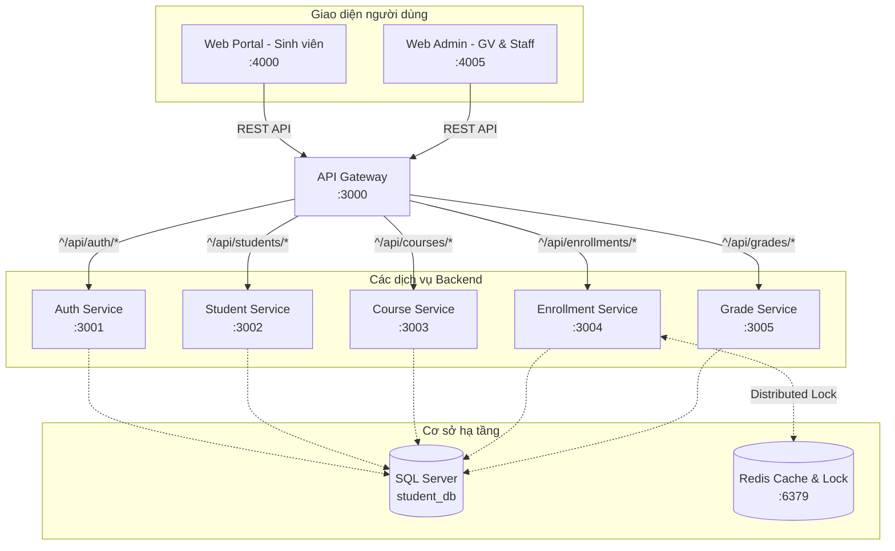
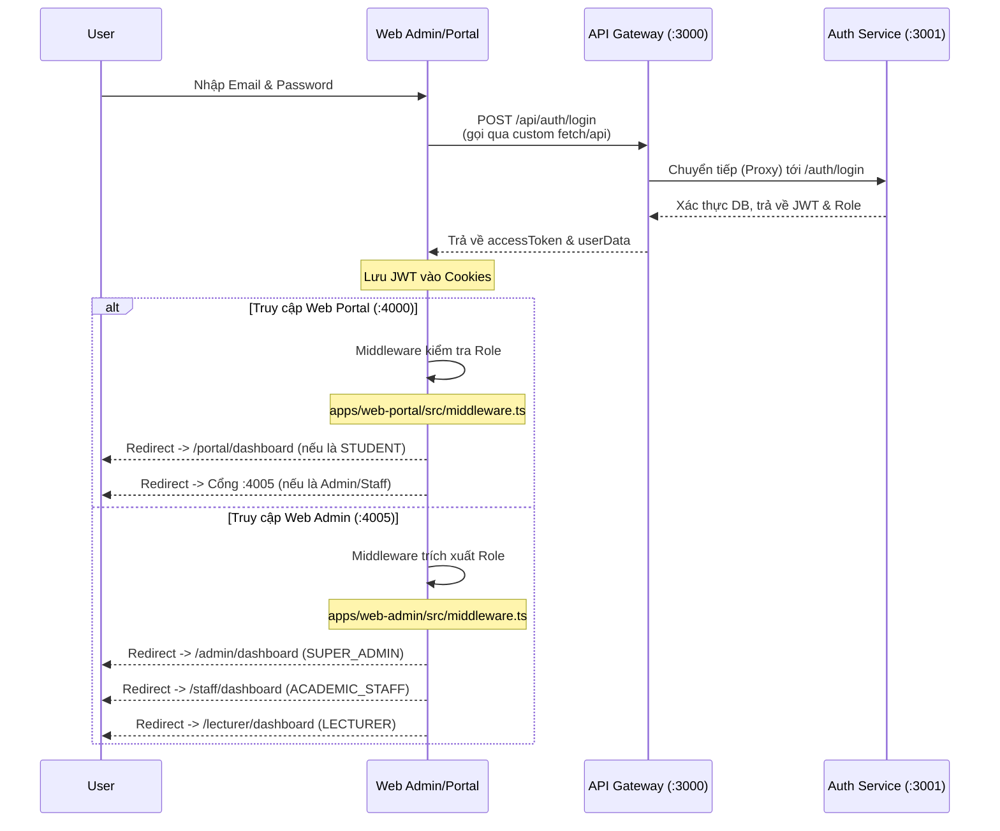
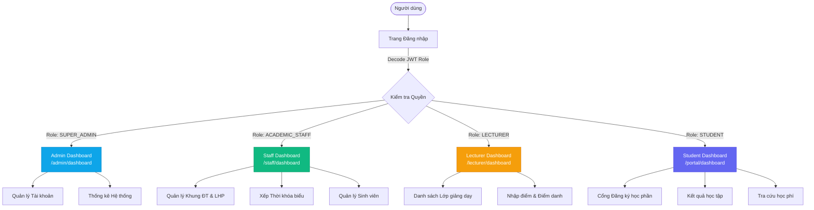

# Báo cáo Chi tiết Hệ thống Quản lý Sinh viên (Microservices)

Đây là tài liệu phân tích chi tiết về kiến trúc, luồng dữ liệu, cách cài đặt và vận hành hệ thống Quản lý Sinh viên (University Management System), được xây dựng theo chuẩn Microservices và cấu trúc Monorepo.

## 1. Cấu trúc Dự án (Monorepo với Turborepo)
Dự án được khởi tạo và quản lý dưới dạng **Monorepo** sử dụng **Turborepo** (`turbo`). Cấu trúc tổ chức mã nguồn giúp việc chia sẻ code (DTOs, Utils, Database Schema) giữa các service trở nên dễ dàng và đồng bộ.

### Tổ chức thư mục chính:
- `apps/`: Chứa các ứng dụng độc lập, bao gồm các Microservices (Backend) và các ứng dụng Frontend.
  - `api-gateway`: Cổng giao tiếp API (:3000).
  - `auth-service`: Dịch vụ xác thực và quản lý người dùng (:3001).
  - `student-service`: Dịch vụ hồ sơ sinh viên và tài chính (:3002).
  - `course-service`: Dịch vụ đào tạo và môn học (:3003).
  - `enrollment-service`: Dịch vụ cốt lõi xử lý đăng ký học phần (:3004).
  - `grade-service`: Dịch vụ quản lý điểm số (:3005).
  - `web-admin`: Frontend cho Admin bằng Next.js 16 (:4005).
  - `web-portal`: Frontend cho Sinh viên bằng Next.js 14 (:4000).
- `packages/`: Chứa các thư viện dùng chung.
  - `database`: Prisma Schema kết nối với SQL Server.
  - `shared-dto`: Các Data Transfer Object dùng chung giữa các service.
  - `shared-utils`: Các hàm tiện ích dùng chung.
  - `eslint-config` và `typescript-config`: Cấu hình linting và TypeScript.

---

## 2. Công nghệ và Thư viện (Tech Stack)

### Backend (Microservices)
- **Framework**: NestJS (v10+). NestJS cung cấp kiến trúc module hóa mạnh mẽ, thích hợp để xây dựng Microservices.
- **ORM**: Prisma (`@prisma/client`). Prisma quản lý Database Schema dưới dạng declarative và cung cấp Type-safe Database Client.
- **Database**: Microsoft SQL Server.
- **Caching & Lock**: Redis (chạy qua Docker). Được sử dụng chủ yếu để thiết lập Distributed Lock, chống lại tình trạng race-condition (nhiều sinh viên cùng đăng ký 1 slot cuối).
- **API Proxy**: Dùng `http-proxy-middleware` trong API Gateway để chuyển tiếp yêu cầu (forward request) tới các service con.
- **Tài liệu API**: `@nestjs/swagger` hỗ trợ thiết kế Swagger UI.

### Frontend
- **Framework**: Next.js (App Router).
- **Styling**: Tailwind CSS, Framer Motion (cho micro-animations).

---

## 3. Kiến trúc Microservices & Data Flow

Hệ thống tuân thủ nghiêm ngặt chuẩn kiến trúc Microservices. Thay vì một cục Monolithic lớn, dự án chia thành các Domain Services độc lập (Auth, Course, Grade, Enrollment, Student).

### Luồng Hoạt Động Của API Gateway:
API Gateway đóng vai trò là "Cửa ngõ" (Entrypoint) duy nhất từ phía Frontend tới cụm Backend.
1. **Tiếp nhận Request**: Frontend gọi tới API Gateway (Ví dụ: `http://localhost:3000/api/courses/...`).
2. **Xác thực (Auth Guard)**: API Gateway áp dụng `AuthGuard` (Passport JWT) toàn cục để kiểm tra token. Nếu hợp lệ, request tiếp tục.
3. **Định tuyến (Routing)**: API Gateway được ứng dụng `MiddlewareConsumer` với `http-proxy-middleware`. Dựa vào tiền tố URL, Gateway tự động forward (chuyển tiếp) đến đúng Microservice. Cụ thể:
   - `^/api/auth/*` -> `http://127.0.0.1:3001/auth` (Auth Service)
   - `^/api/students/*` -> `http://127.0.0.1:3002/students` (Student Service)
   - `^/api/courses/*`, `^/api/majors/*`, `^/api/subjects/*` -> `http://127.0.0.1:3003/...` (Course Service)
   - `^/api/enrollments/*` -> `http://127.0.0.1:3004/enrollments` (Enrollment Service)
   - `^/api/grades/*` -> `http://127.0.0.1:3005/grades` (Grade Service)
4. **Xử lý tại Microservice**: Microservice sẽ gọi tới Database (SQL Server thông qua Prisma) hoặc Redis (để Lock) và trả về kết quả.
5. **Trả về Client**: Gateway nhận Response từ Service và gửi trả lại Frontend.

### Chuẩn Kiến trúc Microservice:
- **Loose Coupling**: Mỗi service xử lý một domain riêng.
- **Shared Database Pattern**: (Do Prisma Schema đang đặt chung tại thư mục `packages/database`, các service hiện đang cùng mapping đến chung một Database vật lý `student_db`. Đây là dạng "Shared Database Pattern" trong Microservices, giúp dễ dàng query data liên kết trong giai đoạn đầu, dẫu chuẩn nghiêm ngặt nhất thường là "Database per service").
- **Communication (Giao tiếp)**: Giao tiếp nội sinh hoặc từ ngoài vào hiện thực hiện trực tiếp qua cơ chế REST/HTTP Proxy.

---

## 4. Tài liệu API & Swagger UI

Một điểm cải tiến đặc sắc trong hệ thống này là cách tổ chức Swagger UI ở mô hình Microservices.
- **Tại mỗi thẻ (Microservice)**: Mỗi module như `auth-service` hay `course-service` đều có tệp cấu hình Swagger riêng (vd: Swagger setup cho path `/auth/docs`), dùng `@ApiBody` hay `@ApiProperty` trong `shared-dto` để định nghĩa kiểu dữ liệu cho Body Request (giúp người dùng có thể nhập tham số ngay trên UI).
- **Tại API Gateway**: 
  Gateway thực hiện việc **Tổng hợp** (Aggregation). Trong tệp `apps/api-gateway/src/main.ts`, Gateway tạo ra 1 Swagger Document chung, sử dụng tùy chọn `urls` trỏ về các endpoint JSON cung cấp tài liệu của các service con (ví dụ: `/api/auth/docs-json`).
  Kết quả là Admin/Dev chỉ cần vào 1 link duy nhất (http://localhost:3000/api-docs) và có cái menu dropdown để chọn xem tài liệu của từng service lẻ, rất tiện cho việc tìm hiểu mã và test API trực quan. 

---

## 5. Hướng dẫn Thiết lập & Vận hành Dự án

### 5.1 Yêu cầu trước khi cài đặt:
- Node.js (từ version 18 trở lên).
- Docker và Docker Compose (dùng để rết Redis).
- Microsoft SQL Server (hoặc cấu hình chuỗi kết nối của DB có sẵn).

### 5.2 Các bước chạy dự án:

1. **Cài đặt thư viện**:
   Chạy ở thư mục gốc (Root directory):
   ```bash
   npm install
   ```
   Do đây là monorepo, lệnh này sẽ cài đặt toàn bộ package cho tất cả các `apps` và `packages`.

2. **Khởi động Redis Container**:
   Docker Compose sẽ cấp phát 1 container Redis ở port 6379, rất quan trọng cho microservice `enrollment-service`.
   ```bash
   docker-compose up -d
   ```

3. **Cấu hình Biến môi trường (.env)**:
   Bạn copy `.env.example` ra `.env` với ít nhất 3 tham số sau:
   - `DATABASE_URL`: Đường dẫn kết nối SQL Server (ví dụ: `sqlserver://localhost:1433;database=student_db;user=SA;password=YourPassword;trustServerCertificate=true`).
   - `REDIS_URL`: `redis://localhost:6379`
   - `JWT_SECRET`: Khóa bí mật JWT (vd: `sms_secret_key`)

4. **Đồng bộ Database & Đổ dữ liệu mẫu (Seeding)**:
   Giao tiếp với Prisma để tạo bảng trong SQL Server, tương thích với sơ đồ ERD đã định nghĩa:
   ```bash
   npm run db:push
   npm run db:seed
   ```
   *Lưu ý: `db:generate` sẽ được prisma tự động chạy hoặc có thể chạy `npm run db:generate` để tạo ra Prisma Client Type-safe dùng cho NestJS.*

5. **Chạy toàn bộ hệ thống**:
   ```bash
   npm run dev
   ```
   Turborepo (`turbo run dev`) sẽ tự động chạy tất cả các script `dev` bên trong các thư mục `apps/*`. Hệ thống lúc này sẽ khởi động:
   - Các API Services: 3001 đến 3005.
   - API Gateway: 3000.
   - Web Student (Portal): 4000.
   - Web Admin: 4005.

### 5.3 Cách cập nhật khi thay đổi CSDL
Mỗi khi bạn sửa file `packages/database/prisma/schema.prisma` để thêm cột/bảng mới:
1. Chạy `npx prisma db push` để đẩy thiết kế mới này vào SQL Server vật lý.
2. Chạy `npx prisma generate` để sinh lại class Database Object cho code TypeScript nhận biết thay đổi bổ sung.

---

## 6. Điểm Đáng Chú Ý Về Nghiệp Vụ
- Hệ thống hỗ trợ bài toán **Đăng ký học phần chịu tải cao**: `courseClass` có field `currentSlots` và `maxSlots`. Khi Sinh viên ấn "Đăng ký", `enrollment-service` dựa vào Redis Lock để kiểm soát slot, tránh trường hợp 2 sinh viên được pass vào 1 slot duy nhất.
- Hệ thống phân biệt rất rõ các quyền hành: **SUPER_ADMIN**, **ACADEMIC_STAFF**, **LECTURER**, và **STUDENT** dựa vào Enum định nghĩa tại JWT. Việc kiểm tra quyền này được diễn ra liên tục tại Gateway và qua các Custom Guard nội bộ tại các Service.

---

## 7. Chi tiết Kiến trúc & Luồng Dữ liệu (Sơ đồ)

### 7.1 Sơ đồ Kiến trúc Cổng & Microservices (Port Routing)

Mỗi ứng dụng Frontend và Backend Service đều được gán một cổng (port) riêng biệt để đảm bảo tính độc lập khi chạy ở môi trường phát triển (Local).



### 7.2 Luồng Xác thực (Login Flow) & Phân quyền dẫn trang

Quá trình đăng nhập được tách biệt rõ ràng giữa cổng Web Portal và Web Admin để đảm bảo an ninh, tuy nhiên cả hai đều gọi về chung một `API Gateway` để xác thực qua `Auth Service`.



**Mô tả kỹ thuật Code:**
- **Web Portal** (`apps/web-portal/src/app/(auth)/login/page.tsx`): Sau khi gọi `api.post("/api/auth/login")` thành công, client lưu 3 giá trị `student_accessToken`, `student_role`, và `student_user` vào Cookie. `middleware.ts` sẽ đọc `student_role`, nếu không phải Sinh viên thì bắt buộc chuyển hướng rời khỏi trang `/portal/*`. Tương tự, nếu cố truy cập `/admin/*`, middleware sẽ ép chuyển hướng sang cổng `http://localhost:4005`.
- **Web Admin** (`apps/web-admin/src/app/login/page.tsx`): Sử dụng hàm `fetch` gốc gửi yêu cầu tới cổng (:3000), sau khi nhận dữ liệu, ghi các cookie `admin_accessToken` và `admin_role`. File `apps/web-admin/src/middleware.ts` sau đó sẽ sử dụng hàm `getDashboardPath(role)` để trực tiếp điều hướng:
  - `SUPER_ADMIN` đi vào hệ thống báo cáo chính `/admin/dashboard`.
  - `ACADEMIC_STAFF` đi vào hệ thống quản lý lịch và kỳ học `/staff/dashboard`.
  - `LECTURER` chỉ được giới hạn ở khu vực nhập điểm và điểm danh `/lecturer/*`. Toàn bộ hành vi "nhảy" trang ngoài luồng đều bị middleware này chặn lại.

### 7.3 Luồng Hiển thị Dashboard / Danh sách Dữ liệu (CSR Fetching)

Ví dụ với bảng điều khiển Admin (`apps/web-admin/src/app/(admin-role)/admin/dashboard/page.tsx`), hệ thống sử dụng kiến trúc kết xuất phía Client (Client-Side Rendering - CSR) với React Hooks:

```mermaid
graph LR
    A[Truy cập /admin/dashboard] -->|Render UI Skeleton| B{Khởi tạo Trạng thái}
    B -->|Bật Loading = true| C[Hiển thị Spinner / UI mờ]
    B -->|useEffect kích hoạt| D[Cookie lấy thông tin cấu hình User]
    D --> E[Gọi API fetch() tới /api/students/dashboard/stats<br/>Đích: Gateway :3000]
    E --> F[Gateway chuyển tiếp tới Student/Course Service]
    F --> G[Service truy vấn DB SQL Server trả về JSON<br/>(Tổng sv, Tổng doanh thu...)]
    G --> H[Cập nhật dữ liệu vào biến 'stats']
    H -->|Tắt Loading = false| I[Hiển thị Charts & Danh sách đầy đủ]
```

- Bằng việc sử dụng các thư viện hỗ trợ render (như Recharts hoặc thẻ vẽ trực quan được code sẵn), dữ liệu trả về từ API ngay lập tức được React phân tách theo state để "hydrate" thành các UI tương tác (Interactive Data Visualization: `EnrollmentChart`, `GpaPieChart`).
- Các trang danh sách dữ liệu (như Lớp học phần, Sinh viên) đều theo mô hình tương tự: 
  `Truy cập có token (middleware bảo mật)` > `Gọi API tới cổng 3000` > `Lưới dữ liệu Cập nhật hiển thị bằng useState`. Việc này đảm bảo việc chia nhỏ tải, không tập trung render HTML gánh quá nặng trên 1 server Next.js duy nhất.

---

## 8. Mô hình Phân quyền (RBAC) & Giao diện Dashboard

Hệ thống sử dụng cơ chế **Role-Based Access Control (RBAC)** được mã hóa trực tiếp trong Payload của JWT Token. Có 4 phân quyền cốt lõi, mỗi phân quyền được thiết kế một không gian làm việc (Dashboard) và luồng nghiệp vụ riêng biệt:

### 8.1 Chi tiết 4 Phân quyền & Chức năng

| Vai trò (Role) | Mã định danh | Cổng truy cập | Chức năng cốt lõi (Core Functions) |
|---|---|---|---|
| **SUPER_ADMIN** | `9xxxxxxxxx` | Web Admin (`:4005/admin/*`) | • Toàn quyền kiểm soát hệ thống.<br/>• Quản lý tài khoản, tạo mới Staff/Lecturer.<br/>• Xem biểu đồ doanh thu, thống kê tổng quát toàn trường.<br/>• Cấp quyền và cấu hình hệ thống (Ví dụ: Đóng/Mở cổng đăng ký). |
| **ACADEMIC_STAFF**| `8xxxxxxxxx` | Web Admin (`:4005/staff/*`) | • Quản lý danh mục cốt lõi: Khoa, Ngành, Môn học.<br/>• Thiết kế chương trình đào tạo.<br/>• Khởi tạo Lớp hành chính, Lớp học phần, Thời khóa biểu.<br/>• Quản lý sinh viên (Hồ sơ, Khen thưởng/Kỷ luật). |
| **LECTURER** | `3xxxxxxxxx` | Web Admin (`:4005/lecturer/*`)| • Xem lịch giảng dạy cá nhân.<br/>• Nhận danh sách lớp học phần (Giao diện readonly danh sách).<br/>• Nghiệp vụ điểm danh (Attendance).<br/>• **Nhập điểm (Grading)**: Điểm thành phần, giữa kỳ, thi cuối kỳ (ràng buộc không thể sửa điểm sau khi đã "Khóa điểm"). |
| **STUDENT** | `Mã SV` | Web Portal (`:4000/portal/*`)| • **Đăng ký học phần**: Chọn lớp, hủy lớp trong thời gian quy định.<br/>• Theo dõi tiến độ học tập: CPA/GPA, số tín chỉ tích lũy, biểu đồ thống kê cá nhân.<br/>• Xem thời khóa biểu cá nhân, tra cứu bảng điểm.<br/>• Thanh toán học phí, công nợ. |

### 8.2 Sơ đồ Luồng Phân quyền (Navigation Map)



### 8.3 Hình ảnh Giao diện (Screenshots)

Dưới đây là các ảnh chụp màn hình (Dashboard) đại diện cho không gian làm việc của từng phân quyền.

*(Lưu ý: Bạn hãy chụp ảnh màn hình các trang Dashboard tương ứng và dán vòng link gốc hoặc lưu file vào thư mục dự án rồi trỏ đường dẫn vào các block dưới đây 👇)*

**1. Màn hình Dashboard SUPER_ADMIN**
> Hiển thị các block thống kê tổng trường, biểu đồ doanh thu (Tỷ VND), phân bổ điểm GPA quy mô lớn và log hoạt động.


**2. Màn hình Dashboard ACADEMIC_STAFF (Phòng Đào Tạo)**
> Tập trung vào số lượng Khoa, Ngành, số Lớp học phần đang mở và tình trạng thu học phí theo ngành.


**3. Màn hình Dashboard LECTURER (Giảng viên)**
> Hiển thị thời khóa biểu giảng dạy hôm nay, danh sách các môn phụ trách, và thông báo nhắc nhở nhập điểm.


**4. Màn hình Dashboard STUDENT (Sinh viên - Web Portal)**
> Hiển thị thẻ sinh viên số, Tiến độ học tập cá nhân (Biểu đồ Tín chỉ), GPA/CPA, sơ đồ lịch học tuần và lịch sử đăng ký.


---

## 9. Kiến trúc Tối ưu hóa Bộ nhớ (Localized Cache Architecture)

Một trong những vấn đề phổ biến khi khởi chạy các dự án Monorepo lớn (như sử dụng song song Next.js và Turborepo) là sự tiêu thụ dung lượng ngầm cực lớn, thường làm tràn ổ đĩa hệ thống (Ổ C:) thông qua quá trình sinh file tạm.

Để hệ thống hoạt động ổn định và có thể dễ dàng chuyển giao sang các máy tính mới, dự án đã được thiết kế kiến trúc **Tối ưu hóa bộ nhớ Cục bộ (Localized Cache Architecture)** với các đặc tính:

### 9.1 Cơ chế Đóng thùng NPM Cache (`.npmrc`)
Thay vì tải toàn bộ thư viện về thư mục trung tâm `AppData` của hệ điều hành, cấu hình bộ đệm nội bộ được ghim sống vào dự án.
- Vị trí thiết lập: File `.npmrc` ở thư mục gốc.
- Tính năng: Lệnh `cache=./.npm-cache` ép quá trình cài đặt thư viện tạo thẳng bộ nhớ tạm vào dự án. Hệ thống sẽ **không rò rỉ bất kỳ file tạm nào ra ổ đĩa C:** của máy chủ.
- Tự động tắt quá trình thu thập log không cần thiết của frontend bằng biến: `NEXT_TELEMETRY_DISABLED=1`.

### 9.2 Cơ chế Lưu vết Turborepo Cục bộ
Turborepo mặc định lưu lịch sử biên dịch (build logs) vào AppData gây đầy ổ nhanh chóng sau nhiều lần F5. 
- Dự án đã được ghi đè câu lệnh khởi động tại dòng lệnh `script` của `package.json`.
- Cấu hình: `--cache-dir=".turbo_cache"`.
- Điểm mạnh: Quá trình phân luồng song song (với `--concurrency 20`) giờ đây sẽ lưu toàn bộ log build tĩnh vào thư mục ẩn `.turbo_cache` ngay bên cạnh file `package.json`.

**📌 Tổng kết ưu điểm:** 
Hệ thống nay đã trở thành một **"Sandbox" độc lập**. Bạn hoàn toàn có thể copy toàn bộ dự án nén vào USB, đem sang máy tính khác (ở trường, ở nhà) để bung ra chạy trực tiếp mà không sợ gặp lỗi (ENOSPC - Error No Space) do đầy ổ C như các dự án Web thông thường. Mọi file rác phát sinh sẽ tự nạp vào ổ đĩa nơi bạn đặt dự án và bị xóa sạch khi bạn xóa thư mục code.
